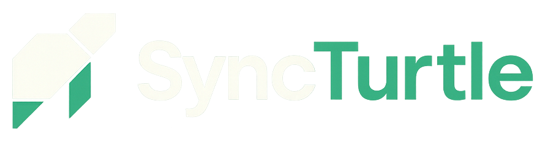

<a id="readme-top"></a>

<br/>
<div align="center">
  
  <h3 align="center">Frontend - Work In Progress</h3>
  <p align="center">
    SyncTurtle - Open-source, extensible personal management
    <br />
    <a href="https://github.com/TwiceBoogie/syncturtle-frontend"><strong>Explore the docs »</strong></a>
    <br />
    <br />
    <a href="https://github.com/TwiceBoogie/syncturtle-frontend">View Demo</a>
    &middot;
    <a href="https://github.com/TwiceBoogie/syncturtle-frontend/issues/new?labels=bug&template=bug_report.md">Report Bug</a>
    &middot;
    <a href="https://github.com/TwiceBoogie/syncturtle-frontend/issues/new?labels=enhancement&template=feature_request.md">Request Feature</a>
  </p>
</div>

<!-- TABLE OF CONTENTS -->
<details>
  <summary>Table of Contents</summary>
  <ol>
    <li>
      <a href="#about-the-project">About The Project</a>
      <ul>
        <li><a href="#built-with">Built With</a></li>
      </ul>
    </li>
    <li>
      <a href="#getting-started">Getting Started</a>
      <ul>
        <li><a href="#prerequisites">Prerequisites</a></li>
        <li><a href="#installation">Installation</a></li>
      </ul>
    </li>
    <li><a href="#usage">Usage</a></li>
    <li><a href="#roadmap">Roadmap</a></li>
    <li><a href="#contributing">Contributing</a></li>
    <li><a href="#license">License</a></li>
    <li><a href="#contact">Contact</a></li>
    <li><a href="#acknowledgments">Acknowledgments</a></li>
  </ol>
</details>

## About The Project

The frontend of the [syncturtle-backend](https://github.com/TwiceBoogie/syncturtle-backend)

<p align="right">(<a href="#readme-top">back to top</a>)</p>

### Built With

### Frontend (Built With)

<!-- Core -->


<!-- Styling / UI -->


<p align="right">(<a href="#readme-top">back to top</a>)</p>

## Getting Started

The infrastructure must be run on docker containers. The docker-compose.yaml file is located at
[syncturtle-backend](https://github.com/TwiceBoogie/syncturtle-backend)

### Prerequisites

- Must have Docker engine installed
- Clone and run [syncturtle-backend](https://github.com/TwiceBoogie/syncturtle-backend)
- Yarn installed
- **Memory**: Minimum **12 GB RAM** recommended
  > ⚠️ Running the project on a system with only 8 GB RAM may lead to setup failures or memory crashes (especially during Docker container build/start or dependency install). Use cloud environments like GitHub Codespaces or upgrade local RAM if possible.

### Installation

1. Clone the repo

```shell
git clone https://github.com/TwiceBoogie/syncturtle-frontend.git [folder-name]
cd [folder-name]
```

2. Install dependencies

```shell
yarn install
```

3. Run project

```shell
yarn dev
```

4. Open your browser to http://localhost/god-mode/ to register yourself as instance admin
   > If you get `Instance not setup` error, try/redo [syncturtle-backend](https://github.com/TwiceBoogie/syncturtle-backend) installation instructions. The `instance-service` must be run with profile `setup`
   > (if done locally) before starting the entire backend.
5. Open your browser to http://localhost then login with the same credentials you used for instance admin

<p align="right">(<a href="#readme-top">back to top</a>)</p>

## Usage

## Roadmap

- [ ] Add Storybook Testing
- [ ] Multi-language Support
  - [ ] Spanish

See the [open issues](https://github.com/TwiceBoogie/syncturtle-frontend/issues) for a full list of proposed features (and known issues).

<p align="right">(<a href="#readme-top">back to top</a>)</p>

<!-- CONTRIBUTING -->

## Contributing

Contributions are what make the open source community such an amazing place to learn, inspire, and create. Any contributions you make are **greatly appreciated**.

If you have a suggestion that would make this better, please fork the repo and create a pull request. You can also simply open an issue with the tag "enhancement".
Don't forget to give the project a star! Thanks again!

1. Fork the Project
2. Create your Feature Branch (`git checkout -b feature/AmazingFeature`)
3. Commit your Changes (`git commit -m 'Add some AmazingFeature'`)
4. Push to the Branch (`git push origin feature/AmazingFeature`)
5. Open a Pull Request

## Contact

Salvador Sebastian - salsebastian13@gmail.com
Project Link: [https://github.com/TwiceBoogie/syncturtle-frontend](https://github.com/TwiceBoogie/syncturtle-frontend)

<p align="right">(<a href="#readme-top">back to top</a>)</p>
